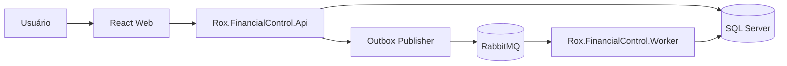
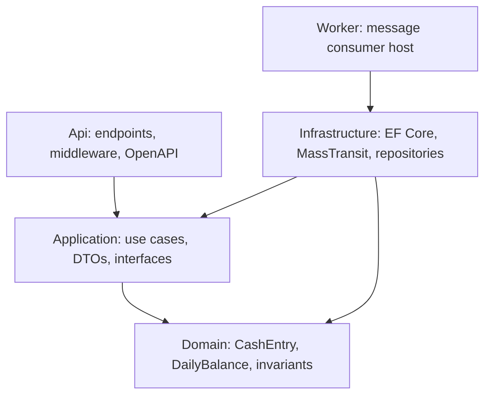
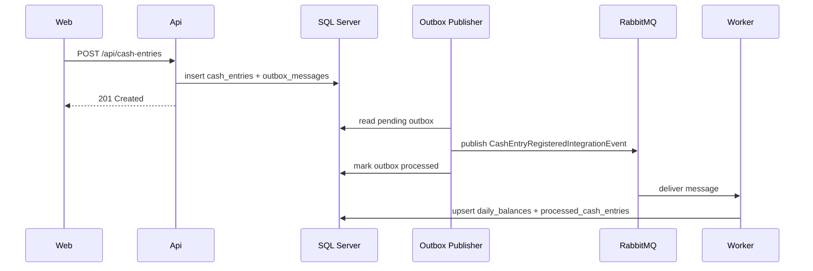
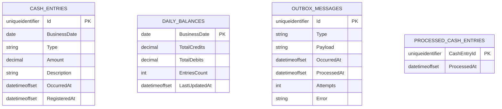

# Arquitetura

## Objetivo

O sistema registra lançamentos financeiros de crédito/débito e consolida saldos diários sem bloquear a aplicação de gestão quando a consolidação estiver indisponível.

## C4 - Container

## Camadas do backend

## Fluxo de criação de lançamento

## Resiliência

- Se o worker parar, a API continua salvando lançamentos.
- Se uma mensagem for entregue duas vezes, `processed_cash_entries` impede dupla consolidação.
- Se a publicação falhar, a outbox fica pendente e será tentada novamente.
- O consumidor usa retry exponencial para falhas transitórias.
- A fila desacopla a taxa de entrada da taxa de processamento da consolidação.

## Modelo de dados

